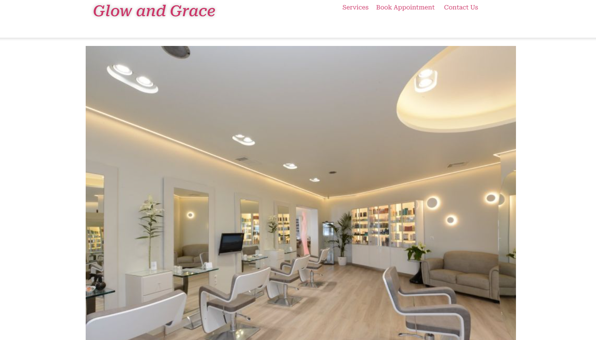

# Glow and Grace - One Page WordPress Website

## 📌 Project Overview
Glow and Grace is a **One Page WordPress website** designed for a beauty salon. It is built using **Elementor Free**, featuring a smooth scrolling navigation, a booking system, and a stylish modern design.

## 🚀 Features
- **One Page Design** with smooth scrolling navigation.
- **Sticky Header** for easy access to navigation links.
- **Service Carousel** to showcase the beauty treatments offered.
- **Appointment Booking System** for customers to schedule services.
- **Responsive Design** for optimal viewing on all devices.
- **Contact Section** with social media links and contact details.

## 📸 Screenshots
### 🔹 Homepage
This is the main view of the website, displaying the beauty salon environment.

### 🔹 Services Section
A carousel displaying different beauty services offered at the salon.

### 🔹 Booking Page
Users can select a service they want to book an appointment for.

### 🔹 Appointment Selection
Customers can pick a date for their appointment.

### 🔹 Time Slot Selection
A user-friendly interface to select a preferred time slot.

### 🔹 Confirmation Page
Once an appointment is booked, users receive a confirmation message.

### 🔹 Contact Us Section
Contact details, including phone number, email, and social media links.

